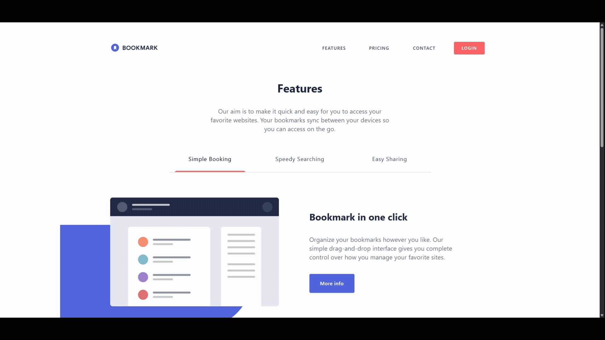

# 📖 Sprint 5 - Bookmark Landing Page React


## 🧠 Goals

- Put into practice React concepts as components, hooks and props.
- Using typescript correctly.
- Structure the project well using atomic design.

## 📝 Key Tasks for the project

- Develop a landing page with functional sections as "Faqs" and "Features".
- Recognize how to separate components to be reusable.
- Make a responsive and improved design.

## 🎥 Preview

### 📚  Bookmark Landing Page View


---


## 🛠️ Getting Started

### 1️⃣ Clone this repository

```bash
https://github.com/JlBestMc/S5.-Landing-Page-React.git

```

### 2️⃣ Install Dependencies

Make sure you have Node.js installed. Then install the packages:

```bash
npm install
```

### 3️⃣ Start Development Server

```bash
npm run server
```


## 📁 Project Structure

```
📦 Landing-Page
┣ 📂 public
┣ 📂 preview
┣ 📂 src/
  ┣ 📂 assets  
  ┣ 📂 Components
    ┣ 📂 Atoms
      ┣ 📄 Anchor.tsx
      ┣ 📄 Burger.tsx
      ┣ 📄 Button.tsx
      ┣ 📄 Logo.tsx
      ┗ 📄 Tab.tsx
    ┣ 📂 Molecules
      ┣ 📄 Card.tsx
      ┣ 📄 Dropdown.tsx
      ┣ 📄 EmailForm.tsx
      ┣ 📄 Hero.tsx
      ┗ 📄 Navbar.tsx
    ┣ 📂 Cards
      ┣ 📄 ContactUs.tsx
      ┣ 📄 Faqs.tsx
      ┣ 📄 Features.tsx
      ┣ 📄 Footer.tsx
      ┗ 📄 Header.tsx
    ┣ 📂 data
      ┗ 📄 data.ts
    ┣ 📄 app.tsx
    ┣ 📄 main.tsx
    ┗ 📄 styles.css
┗ 📄 index.html

```

## 🛠 Technologies Used

    - TypeScript
    - React
    - HTML
    - CSS (Tailwind)


## ⏳ Project Status
